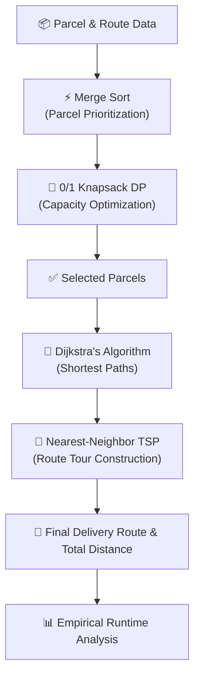

# 🚚 Mini Courier Planner

A Design and Analysis of Algorithms (DAA) Capstone Project.

---

## 🎓 Project & Student Information
- **Project Title:** Mini Courier Planner
- **Author:** Vinayak Vashisth
- **Roll Number:** 2501730150
- **Programme:** B.Tech CSE (AI & ML)
- **Course:** Design and Analysis of Algorithms (DAA)

---

## 📌 Project Overview
Mini Courier Planner is a Python-based courier planning system that prioritizes parcels, selects an optimal set of parcels within vehicle capacity, computes shortest delivery paths, and generates an optimized delivery route.

## ⚙️ Algorithms Used
- **Merge Sort** – Parcel prioritization based on priority rank and delivery deadlines
- **0/1 Knapsack (Dynamic Programming)** – Optimal parcel selection maximizing value under vehicle capacity constraint
- **Dijkstra's Algorithm** – Single-source shortest path calculation on the road network
- **Nearest-Neighbor TSP** – Heuristic delivery tour planning
- **Empirical Runtime Analysis** – Algorithmic benchmarking across scaling input sizes

## 🔄 Project Flow




## 📁 Project Structure

```text
Mini-Courier-Planner/
├── datasets/
│   ├── parcels.csv               # Input parcel dataset (weights, values, priorities, deadlines)
│   └── routes.csv                # Delivery network graph with edge weights (distances in km)
├── images/
│   ├── performance_results.csv   # Benchmarking logs recorded across varying input sizes
│   ├── route_visualization.png   # Visual plot of the final TSP customer delivery route
│   └── runtime_chart.png         # Comparative runtime scaling chart
├── src/
│   ├── sorting.py                # Merge Sort implementation for parcel prioritization
│   ├── knapsack.py               # 0/1 Knapsack dynamic programming algorithm
│   ├── dijkstra.py               # Dijkstra's algorithm for single-source shortest paths
│   ├── tsp.py                    # Nearest-Neighbor TSP heuristic for delivery route planning
│   └── performance.py            # Execution profiler and timing utilities
├── mini_courier_planner.ipynb    # Complete interactive Jupyter pipeline and analysis
├── requirements.txt              # Python library dependencies
├── .gitignore                    # Git untracked files specification
└── README.md                     # Project documentation and execution instructions
```


## 🚀 Execution Guide
1. **Install required dependencies:**
   ```bash
   pip install -r requirements.txt
   ```

2. **Open and run the notebook:**
   ```bash
   jupyter notebook mini_courier_planner.ipynb
   ```

## 📊 Performance Analysis
The algorithms were benchmarked across varying input sizes ($N = 10, 25, 50, 100, 200$). Experimental runtime results and visualizations are saved in:
- `images/performance_results.csv`
- `images/runtime_chart.png`

## 🏁 Outputs & Results
- Prioritized parcels sorted by urgency and deadlines
- Globally optimal parcel subset fitting vehicle payload
- Shortest delivery paths from the central warehouse
- Complete TSP delivery tour with expanded traversal path
- Overall route distance and benchmark comparisons

## 🛠️ Technologies
- **Python 3**
- **Pandas** – Dataset manipulation
- **NetworkX** – Graph representation and modeling
- **Matplotlib** – Route and performance visualization
- **Jupyter Notebook** – Interactive execution and reporting